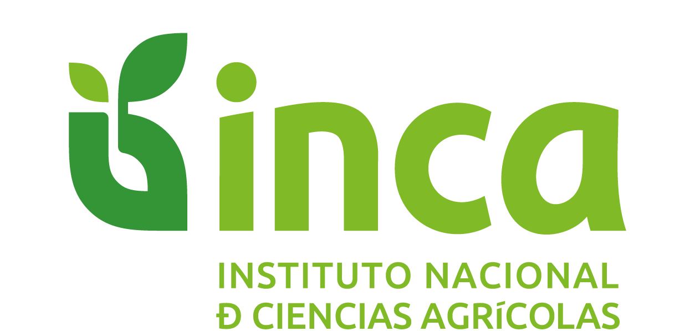

# Abonar

<p align="center">
  
</p>

**Abonar** es una aplicación Android diseñada para la gestión y optimización de abonos verdes.

---

<p align="center">
  <b>Instituciones y Proyectos Colaboradores:</b><br><br>
   &nbsp;&nbsp;&nbsp;
   &nbsp;&nbsp;&nbsp;
  
</p>

## 🚀 Características

- Gestión de cultivos de abonos verdes.
- Seguimiento de nutrición y suelos.
- Interfaz moderna construida íntegramente con **Jetpack Compose**.
- Inyección de dependencias con **Hilt**.
- Persistencia de datos local con **Room**.
- Comunicación con API REST mediante **Retrofit**.

## 🛠️ Especificaciones Técnicas

- **Lenguaje:** Kotlin
- **Minimum SDK:** 24 (Android 7.0)
- **Target SDK:** 36
- **Compile SDK:** 37
- **Arquitectura:** MVVM / Clean Architecture (sugerida por el uso de Hilt y Room)
- **UI:** Jetpack Compose (Material 3)

## 📦 Construcción del Proyecto

Para compilar el proyecto localmente, asegúrate de tener instalado Android Studio (versión Ladybug o superior recomendada) y el JDK 17.

```bash
# Clonar el repositorio
git clone <url-del-repositorio>

# Entrar al directorio
cd AbonosVerdes

# Compilar el APK de depuración
./gradlew assembleDebug
```

## 🤖 Integración Continua (GitHub Actions)

Este repositorio cuenta con un workflow automático que compila un APK cada vez que se sube una etiqueta (tag) que comience con `Version` (ejemplo: `Version-1.0`). El APK resultante estará disponible en los artefactos de la ejecución del workflow.

## 📝 Licencia

Este proyecto es propiedad de **INCA (Instituto Nacional de Ciencias Agrícolas)**.
